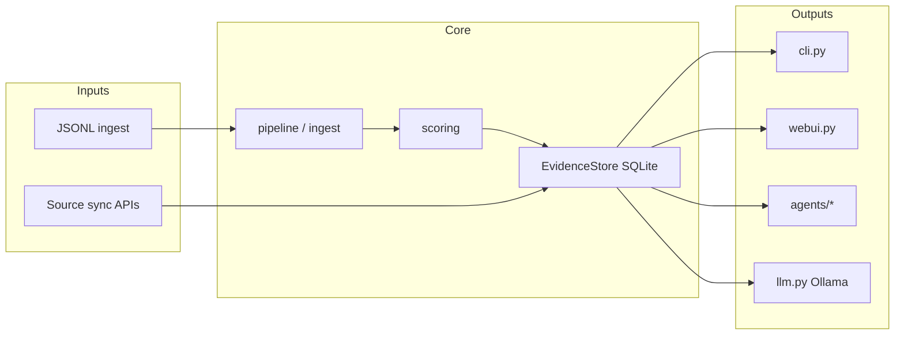

# AGENTS.md — Cursor guidance for canoniga

This file orients AI agents working in the **canoniga** repository (`als-intel` v0.1.0): a local-first ALS scientific intelligence platform with stdlib-only runtime dependencies.

## Project purpose

- Ingest, score, and store ALS-related evidence claims in SQLite.
- Detect contradictions, track confidence drift, and rank hypotheses.
- Run deterministic agents (literature, skeptic, debate, graph, repurposing).
- Ground local LLM chat (Ollama) on in-database evidence.
- Expose CLI and a monolithic HTTP web UI for investigators.

Design principles: **local-first**, **inspectable heuristics**, **human review gates**, **benchmark-gated model evaluation**.

Governance docs: [docs/MISSION.md](docs/MISSION.md), [docs/ETHICS_AND_OVERSIGHT.md](docs/ETHICS_AND_OVERSIGHT.md), [docs/HUMAN_OVERSIGHT.md](docs/HUMAN_OVERSIGHT.md). Roadmap tracking: [ai/plans/SCIENTIFIC_FIDELITY_ROADMAP.md](ai/plans/SCIENTIFIC_FIDELITY_ROADMAP.md).

## Architecture



### Module map

| Layer | Path | Role |
|-------|------|------|
| Entry points | `src/als_intel/cli.py`, `__main__.py`, `webui.py` | CLI (38+ subcommands), HTTP server |
| Domain model | `src/als_intel/models.py` | `EvidenceRecord`, validation constants |
| Persistence | `src/als_intel/store.py` | SQLite schema, queries, auth tables |
| Ingestion | `src/als_intel/pipeline.py`, `ingest.py` | JSONL → scored records |
| Scoring | `src/als_intel/scoring.py` | Reliability decomposition |
| Sync | `src/als_intel/sync.py`, `scheduler.py`, `connectors.py` | Incremental source sync |
| Extractors | `src/als_intel/extractors/*` | 15 biomedical source adapters |
| Agents | `src/als_intel/agents/*` | Literature, skeptic, debate, graph, etc. |
| Hypothesis | `src/als_intel/hypothesis.py` | Queue ranking, causal gates |
| LLM / ML | `src/als_intel/llm.py`, `finetune_data.py`, `training.py`, `evaluation.py`, `benchmark*.py` | Ollama chat, fine-tune export, benchmarks |
| Auth | `src/als_intel/auth.py` | Magic-link sessions, CSRF |

### Safe change zones

| Zone | Risk | Guidance |
|------|------|----------|
| `agents/`, `extractors/` | Low | Preferred extension points |
| `cli.py` (new subcommands) | Medium | Follow existing argparse patterns |
| `store.py` (~3.3k lines) | High | Schema changes need migration logic |
| `webui.py` (~3.5k lines) | High | Add helpers near related handlers; avoid drive-by refactors |

## Development workflow

### Setup

**Requires Python 3.10+.** macOS Command Line Tools ship Python 3.9, which is too old. Install a newer interpreter first:

```bash
brew install python@3.11
```

Then create a venv and install:

```bash
python3.11 -m venv .venv && source .venv/bin/activate
python -m pip install -e ".[dev]"
make init-db
make ingest-sample
```

Or use `make setup` after activating the venv (Makefile auto-detects `python3.11`, `python3.12`, or `python3.10` on macOS/Linux).

**Platform note:** On Windows, the Makefile defaults to `py -3`. On macOS/Linux it picks the first Python 3.10+ binary on `PATH`. Override if needed:

```bash
make PYTHON=python3.11 test
```

### Common commands

| Command | Purpose |
|---------|---------|
| `make test` | Full pytest suite |
| `make lint` | Syntax check (`compileall`) |
| `make test-regression-queries` | Canonical chat/guardrail regression |
| `make benchmark-gate` | Validate → merge → evaluate templates |
| `make benchmark-gate-strict` | Curated benchmark gate (CI strict) |
| `make docker-up` | Docker stack + DB bootstrap + sample ingest |
| `make docker-dev-up` | Hot-reload dev stack |

### Run web UI locally

```bash
python -m als_intel.webui --db data/als_intel.sqlite --ollama-host http://localhost:11434 --model llama3.1:8b
```

## Coding conventions

- **Stdlib only** for runtime — do not add packages to `[project.dependencies]`.
- `from __future__ import annotations` in all modules.
- `@dataclass(slots=True)` for record types; validate with `VALID_*` sets and `ValueError`.
- Absolute imports: `from als_intel...`.
- SQLite access only through `EvidenceStore` — no ad-hoc `sqlite3` in feature code.
- CLI: add subcommands in `build_parser()`, dispatch in `main()`.

## Data layout

| Path | Contents |
|------|----------|
| `data/` | Runtime SQLite DBs, models, evals, finetune artifacts (gitignored) |
| `examples/` | Sample JSONL for ingestion |
| `config/` | Sync plans, benchmark gate policy |
| `benchmarks/curated/` | Curated benchmark JSONL for strict CI |
| `tests/fixtures/` | Regression query fixtures |

## Testing

- Framework: **pytest** (installed via `.[dev]`).
- Use `tmp_path` for isolated databases; seed via `EvidenceStore` or inline JSONL.
- Avoid live network calls in unit tests.
- Web UI tests: `ThreadingHTTPServer` + `urllib.request` (see `tests/test_webui_api.py`).
- Update `tests/fixtures/regression_queries.json` only when changing chat/guardrail behavior.

## CI gates

Two GitHub Actions workflows must stay green:

- `.github/workflows/benchmark-gate.yml` — full pytest + regression queries + benchmark gate smoke
- `.github/workflows/benchmark-gate-strict.yml` — curated benchmark validation + strict gate

Do not break regression queries or benchmark gates when modifying chat, guardrails, or evaluation logic.

## Environment variables (web/auth)

Key variables (full list in README):

- `ALS_DB_PATH`, `OLLAMA_HOST`, `OLLAMA_MODEL` — runtime paths and LLM
- `ALS_AUTH_ENABLED`, `ALS_MAGIC_LINK_DEV_MODE` — auth gate (dev mode returns link in API)
- `ALS_CSRF_SECRET` — CSRF for authenticated POST endpoints
- SMTP: `ALS_SMTP_HOST`, `ALS_SMTP_USER`, `ALS_SMTP_PASSWORD` — never commit credentials
- Local email testing: `make docker-dev-up` wires SMTP to Mailpit at http://localhost:8025 (magic links sent as real emails, not returned in API)

## Roadmap and plans

Before large features, read the relevant plan in `ai/plans/`:

| Plan | Topic |
|------|-------|
| `PLATFORM_NEXT_STEPS_PLAN.md` | Telemetry, guardrails, regression, ranking |
| `AUTOMATION_FIRST_ROADMAP_PLAN.md` | Autonomous investigation runs |
| `AUTH_SESSION_PLAN.md` | Auth/session hardening |
| `DATASOURCE_PLAN.md` | New data source integration |
| `POSTGRES_MIGRATION_PLAN.md` | Future Postgres migration |

## Cursor rules

File-specific guidance lives in `.cursor/rules/`:

- `project-core.mdc` — always-on project standards
- `python-conventions.mdc` — Python patterns
- `testing.mdc` — test conventions
- `webui.mdc` — monolithic web UI guidance
- `extractors-agents.mdc` — agent and extractor extension patterns
- `emails.mdc` — email template conventions

## Email templates

Branded HTML emails live in [`src/als_intel/emails/`](src/als_intel/emails/). Read [`src/als_intel/emails/README.md`](src/als_intel/emails/README.md) before adding or changing templates. Always ship HTML + plain-text multipart messages; preview locally in Mailpit at http://localhost:8025 (`make docker-dev-up`).
